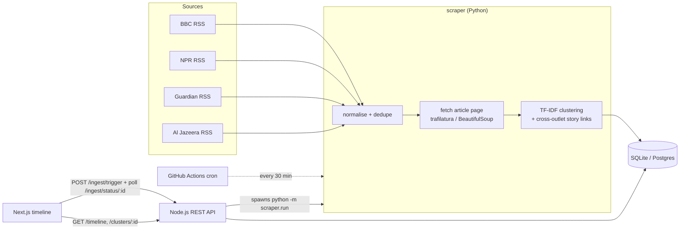

# News Pulse - topic-clustered news timeline

News Pulse pulls live articles from several public news RSS feeds, groups the ones that are about the same topic, and draws each topic as a bar on a timeline (from its earliest to its latest article).

| Part | Tech | Folder |
|---|---|---|
| RSS ingestion, full-text extraction, topic grouping | Python 3 (feedparser, trafilatura, scikit-learn) | [`/scraper`](scraper) |
| REST API + pipeline trigger | Node.js 20+ / Express | [`/backend`](backend) |
| Timeline UI | Next.js 16 / React 19 / TypeScript | [`/frontend`](frontend) |
| Database | SQLite locally, PostgreSQL (Neon / Supabase / Railway) when hosted | [`/db`](db) |

**Live demo:** _[https://frontend-two-rosy-32.vercel.app/]_ &nbsp;|&nbsp; **API:** _[https://news-pulse-api-loko.onrender.com]_ &nbsp;|&nbsp; **Video:** _<add your unlisted video link here>_

---

## 1. Run it on your computer

**You need:** Python 3.10+ (developed on 3.12), Node.js 20+ (developed on 22), and Git (optional). No database server is required - locally the project uses a SQLite file.

### Quick way (one command)

| OS | Command (run from the project folder) |
|---|---|
| Windows (PowerShell) | `powershell -ExecutionPolicy Bypass -File scripts\setup.ps1` |
| macOS / Linux | `bash scripts/setup.sh` |

### Step by step

```bash
# 1) Python environment (from the project root)
python -m venv .venv                   # macOS/Linux: python3 -m venv .venv
.venv\Scripts\activate                 # Windows (cmd).  PowerShell: .\.venv\Scripts\Activate.ps1
source .venv/bin/activate              # macOS/Linux
pip install -r scraper/requirements.txt

# 2) Load real news once (takes ~30-90 s: downloads feeds + article pages)
python -m scraper.run

# 3) Backend API  -> http://localhost:4000      (new terminal)
cd backend
npm install
cp .env.example .env                   # Windows: copy .env.example .env
npm start

# 4) Frontend     -> http://localhost:3000      (another new terminal)
cd frontend
npm install
npm run dev
```

Open **http://localhost:3000**. You can also skip step 2 and click **Refresh data** in the UI - it calls `POST /ingest/trigger`, which runs the same Python pipeline as a subprocess.

The backend finds `<project>/.venv` automatically. If your Python lives elsewhere, set `PYTHON_BIN` in `backend/.env`.

> **PowerShell blocks `Activate.ps1`?** Run `Set-ExecutionPolicy -Scope Process Bypass` first, or use `cmd` and `.venv\Scripts\activate`.

### Work offline (no internet needed)
A fake news wire with three differently-formatted feeds (plus deliberately broken items) is included:
```bash
python -m scraper.devtools.mock_news_server            # leave running in one terminal
# in another terminal (Windows PowerShell: $env:FEEDS_FILE="scraper/devtools/feeds.local.json")
FEEDS_FILE=scraper/devtools/feeds.local.json python -m scraper.run
```
If the API is started with the same `FEEDS_FILE` variable, the **Refresh data** button uses it too.

### Tests
```bash
python -m pytest -q          # 23 Python tests (normalisation, clustering, full pipeline incl. failures)
cd backend  && npm test      # 26 API tests (endpoints, validation, job lifecycle)
cd frontend && npm run typecheck && npm run build
```

### Troubleshooting
| Symptom | Fix |
|---|---|
| UI says *"Cannot reach the API"* | Backend not running, or `NEXT_PUBLIC_API_URL` in `frontend/.env.local` is wrong (default `http://localhost:4000`). Restart `npm run dev` after editing it. |
| Refresh fails with *"Could not start Python"* | Set `PYTHON_BIN` in `backend/.env` to your Python (e.g. `C:\path\to\news-pulse\.venv\Scripts\python.exe`). |
| Timeline is empty | No data yet - click **Refresh data** or run `python -m scraper.run`. Tick *Include single-article topics* to see everything. |
| A feed shows `error` in the run log | That outlet was unreachable/blocked; the run continues with the others. Edit `scraper/feeds.json` to swap it. |

---

## 2. Architecture



* The **scraper** is a plain command (`python -m scraper.run`). It is safe to run repeatedly: only articles it has not seen are downloaded and stored, then all retained articles are re-grouped.
* The **backend** never scrapes itself. `POST /ingest/trigger` starts the Python command as a child process, stores progress in a `jobs` table, and the UI polls `GET /ingest/status/:jobId`. Only one job runs at a time.
* The **database** is shared: Python writes `articles`, `clusters`; Node reads them and also stores `jobs`. Both use the same schema files in `/db`, and the same code runs on SQLite and PostgreSQL.

### API

| Endpoint | Purpose |
|---|---|
| `GET /clusters` | Topic list: `label`, `articleCount`, `timeRange {start,end}`. Query: `minArticles`, `sources`, `from`, `to`, `sort=recent\|size\|oldest`, `limit`, `offset` |
| `GET /clusters/:id` | Full cluster with all articles **sorted chronologically**, plus cross-outlet `stories`. Query: `sources` |
| `GET /timeline` | Chart-ready intervals: `start`, `end`, `durationMinutes`, `articleCount`, `sourceCount`, per-outlet counts and `intensity` (0-1, size relative to the biggest topic). Query: `hours` (default 72), `sources`, `minArticles` (default 2), `limit` |
| `POST /ingest/trigger` | Starts the pipeline, returns **202** with a `jobId` (returns the running job if one is already active; **429** during the cooldown) |
| `GET /ingest/status/:jobId` | `queued \| running \| succeeded \| failed`, current `stage`, run `stats`, `error`, `logTail` |
| `GET /sources` | Outlets with article counts (drives the filter UI) |
| `GET /health` | Liveness + DB check |

Errors are JSON `{ "error": { "code", "message" } }` with proper status codes: **400** malformed input (bad ids, non-numeric limits, invalid dates, unknown sort), **404** unknown cluster/job/route, **429** rate limit / cooldown, **500** unexpected. Configuration comes only from environment variables (`backend/.env.example`), and there are no hard-coded URLs or secrets.

---

## 3. Part 1 - ingestion and topic grouping

**News sources used:** BBC News, NPR, The Guardian (World), Al Jazeera (configurable in [`scraper/feeds.json`](scraper/feeds.json); NYT World is included but disabled because its pages are paywalled).

### Messy feeds -> one schema
`normalize.py` maps every entry to one `Article` shape. It handles:
* `<description>` vs `<content:encoded>` vs Atom `<content>`/`<summary>` (HTML stripped, whichever exists becomes the summary; a real body from the feed is kept as a fallback text).
* Dates: feedparser's parsed date first, then raw strings (`pubDate`, `dc:date`, `updated`...) via `dateutil` with a table of named time zones (EST, IST, BST...). Future dates and nonsense are rejected. When no usable date exists the article is stored with the time it was first seen and flagged `published_estimated` (the UI shows an "approx. time" tag).
* Missing/invalid entries (no title or link) are counted and skipped, not fatal.

### Full article text
For each **new** article the page is downloaded (with timeouts, retries, a size cap and a browser-like user agent) and the main text extracted with **trafilatura**, falling back to a **BeautifulSoup** paragraph extractor. Any failure (HTTP error, paywall stub, non-HTML) yields `content_status = failed` and the article is kept using its feed summary. One broken page never stops a run.

### No duplicates, re-runnable
* Dedupe key 1: SHA-256 of the *canonical URL* (scheme, `www.`, fragments, trailing slashes and tracking parameters such as `utm_*` / `at_medium` are ignored).
* Dedupe key 2: `(source, normalised headline)` - catches the same story republished under a different URL.
* The database also enforces both with unique indexes, so repeated runs cannot store an article twice. Already-known articles are never downloaded again (a second run is fast and reports `new_articles: 0`).
* Articles older than `RETAIN_DAYS` (7) are pruned each run.

### Grouping approach: TF-IDF + cosine similarity + average-linkage clustering (Option B)
1. **Text per article** = headline (counted twice, because it is the strongest topic signal) + feed summary + the first 1,000 characters of the extracted body.
2. **TF-IDF** (unigrams + bigrams, English + news-specific stop words such as "said", "report", weekdays and the outlet names) turns each article into a vector; **cosine similarity** measures how similar two articles are.
3. **Time gate:** articles published more than 48 hours apart are treated as unrelated - a news story is bounded in time, and this stops "election"/"budget" articles from months apart merging.
4. **Average-linkage hierarchical clustering** cuts the tree where the mean similarity inside a group drops below `SIMILARITY_THRESHOLD` (0.20).
5. **Label** = the top 3 TF-IDF terms of the cluster centroid (terms overlapping an already chosen one are skipped), e.g. `Wildfire · Forest · Firefighters`. The **representative headline** is the article closest to the centroid.

Each cluster stores: cluster id, label, keywords, representative headline, and its articles (with `published_at`) - this is what powers the timeline.

**Why this approach:** it stays explainable (a cluster is "articles that share distinctive words, close in time"), needs no model downloads, runs in seconds on free hosting, and average linkage avoids the "chaining" problem of simple overlap rules where A~B and B~C glue unrelated stories together. The simpler **keyword-overlap** approach (Option A) is also implemented and can be selected with `CLUSTER_METHOD=keyword` (or `python -m scraper.run --method keyword`) so the two can be compared.

**How the thresholds were chosen** (all overridable through environment variables):
* `SIMILARITY_THRESHOLD=0.20` - `python -m scraper.inspect_similarities` prints a histogram of pairwise similarities and the closest article pairs. On the bundled sample data, unrelated pairs sit below 0.10 and same-story pairs above 0.45, so the cut belongs somewhere in between; real feeds are noisier and the gap is narrower, so I chose a low-middle value (0.20). Average linkage is already a strict rule - a group only forms if its *mean* pairwise similarity stays above the threshold - so a lower cut-off does not cause chaining.
* `MAX_GAP_HOURS=48`, `RETAIN_DAYS=7` - news cycles rarely run beyond two days; a week of history keeps the timeline useful and the O(n²) similarity matrix small.
* Keyword method: `KEYWORD_MIN_SHARED=3` meaningful shared words, `KEYWORD_MIN_JACCARD=0.10`, and words that appear in more than 15% of articles are ignored as too generic.

> **Before you submit:** run `python -m scraper.inspect_similarities` on your live data, look at the closest pairs, and adjust `SIMILARITY_THRESHOLD` if related stories are split or unrelated ones merged. The automated tests use a synthetic news wire; real feeds are noisier, so it is worth checking with your own eyes.

**Limitation I noticed:** TF-IDF only sees *words*, not meaning. Two outlets that phrase the same event with different vocabulary ("PM"/"prime minister", "walkout"/"strike") can end up in separate clusters, while broad ongoing topics that share many words (for example several separate Middle East stories) can merge into one large cluster. Embedding-based similarity would fix the first problem; the second needs sub-topic splitting.

### Stretch goal: cross-source story merging
`link_stories` links articles from **different outlets** that describe the same event (cosine similarity >= 0.40 within 36 hours) and stores a shared `story_id`, even when the clustering step left the articles in different clusters. The API returns `stories` (outlets involved and other clusters where the story also appears); the UI shows a link badge on the bar and "Same story also from ..." under the article.

---

## 4. Frontend

* **Timeline:** clusters are bars from first to last article on a real time axis (custom-built HTML/CSS layout; `d3-scale` only supplies the time-axis maths), packed into lanes so nothing overlaps, with a "now" marker and day boundaries. Zoom 1x-6x, scroll horizontally, 24 h / 3 d / 7 d windows.
* **Visual sizing (stretch):** taller and darker bar = more articles; the coloured stripe at the bottom shows the outlet mix.
* **Cluster detail:** click a bar - headline, outlet, published time (with relative time) and a link to the original for every article, oldest first.
* **Source filter:** toggle outlets; the API recomputes counts and time ranges for the selected outlets only.
* **Refresh data:** calls `POST /ingest/trigger`, polls `/ingest/status/:jobId` (shows the current stage), then reloads the timeline; failures and cooldowns are explained in plain words.
* **Auto-refresh (stretch):** *Live updates* (on by default) polls `/timeline` every minute while the tab is visible; new or growing topics pulse for a few seconds.
* Extras: topic search, single-article topics toggle, light/dark theme, keyboard focus and `aria` labels, mobile bottom-sheet detail view, cold-start hint for sleeping free hosts. Times are shown in the viewer's local time zone.

---

## 5. Deployment (what runs where, and why)

| Component | Platform | Why |
|---|---|---|
| Frontend (Next.js) | **Vercel** | Zero-config Next.js hosting; `NEXT_PUBLIC_API_URL` points at the API |
| Backend API **and** Python pipeline | **Render** (Docker web service, see [`Dockerfile`](Dockerfile), [`render.yaml`](render.yaml)) | The API spawns Python for *Refresh data*, so Node and Python live in one image |
| Scheduled ingestion | **GitHub Actions** cron ([`ingest.yml`](.github/workflows/ingest.yml)) | Keeps data fresh while the free Render instance sleeps |
| Database | **Neon** (PostgreSQL) | Shared by the API and the cron job; free tier |

Environment variables live on the platforms (Render: `DATABASE_URL`, `CORS_ORIGINS`; Vercel: `NEXT_PUBLIC_API_URL`; GitHub: `DATABASE_URL` secret) - nothing secret is committed. Step-by-step instructions: [`docs/DEPLOYMENT.md`](docs/DEPLOYMENT.md).

---

## 6. Assumptions and decisions

* An article's identity is its canonical URL; "same story from another outlet" is handled by the story link, not by deduplication.
* Every run re-clusters all retained articles, so cluster ids (= smallest article id in the cluster) can change when clusters merge or split.
* Only the newest `CLUSTER_MAX_ARTICLES` (2000) articles are clustered to keep memory bounded on free hosting.
* Single-article topics are stored but hidden on the timeline by default (toggle in the UI).
* Free-tier hosts sleep after inactivity; the first request can take up to a minute.
* There is no user authentication. The trigger endpoint is protected by a rate limit, a single-job lock and a cooldown instead.

## 7. What I would improve with more time
Sentence-embedding similarity (multilingual, handles paraphrase), incremental clustering with stable ids, server-sent events instead of polling, and a per-topic sparkline of publishing rate.

## Repository layout
```
scraper/    Python pipeline: normalize.py, fetcher.py, clustering.py, pipeline.py, run.py, tests/, devtools/
backend/    Express API: src/routes, src/services (clusters, jobs), test/
frontend/   Next.js app: components/Timeline.tsx, Dashboard.tsx, ClusterDetail.tsx, ...
db/         schema.sqlite.sql, schema.postgres.sql
docs/       DEPLOYMENT.md, VIDEO_SCRIPT.md, SUBMISSION_CHECKLIST.md, SUBMISSION_EMAIL.md
```
